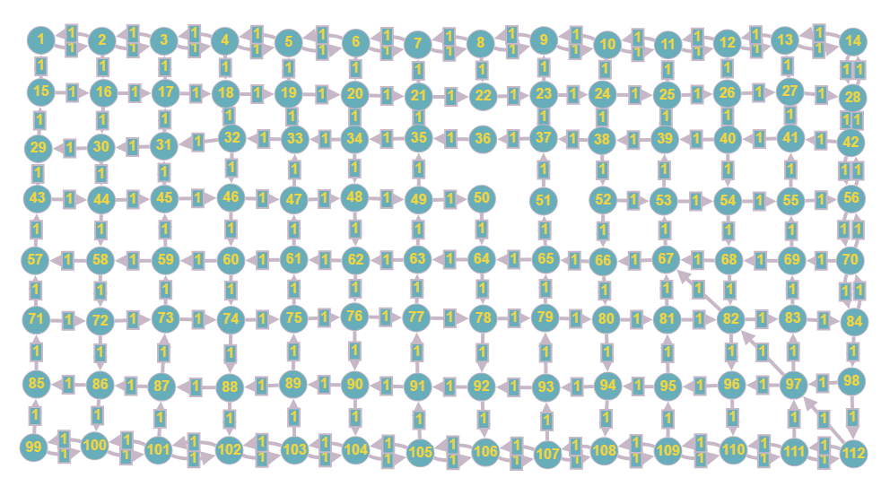

# Proyecto matematicas discretas sobre Concepción

# Nombres de las calles válidos en nuestro programa
A continuación voy a listar como se tiene que ingresar cada calle en nuestro programa.
1. Carrera
2. Maipu
3. Freire
4. Barros Arana
5. O'higgins
6. San Martin
7. Cochrane
8. Chacabuco
9. Arturo Prat
10. Serrano
11. Salas
12. Angol
13. Lincoyan
14. Rengo
15. Caupolican
16. Anibal Pinto
17. Colo Colo
18. Castellon
19. Pedro Aguirre Cerda
20. Tucapel
21. Orompello
22. Ongolmo
23. Paicavi

# Ejemplo de entrada en nuestro programa.
A continuación le presentamos un ejemplo de uso de nuestro programa. Por favor respete la sintaxis o el programa no va a funcionar.
Ejemplo de uso:

Bienvenido/a a nuestro Buscador de Rutas por el centro de Concepción.

Por favor, seleccione la dirección de partida: **Cochrane 212**.

Por favor, seleccione la dirección de destino: **Castellon 200**
¿Desea hacer una parada? [y/n]: **y**

Por favor, ingrese la calle donde desea parar: **Carrera 121**

# Como ejecutar nuestro programa.
Para el caso de sistemas operativos basados en linux hay que tener g++ instalado. Las pruebas que realizamos fueron sobre la version de g++ 13.2.1.

Adicional a esto creamos un makefile para que se ejecute automáticamente el comando para compilar nuestro codigo. Solo escribir make en la carpeta ProyectoDiscretas y debería de generar un ejecutable de nombre a.out. Finalmente utilizar ./a.out para ejecutar el programa.

## En caso de que el makefile falle.
En caso de que el makefile falle realice el siguiente comando en la carpeta ProyectoDiscretas.

g++ src/main.cpp src/dijkstra.cpp src/HashmapCiudad.cpp src/constants.cpp

